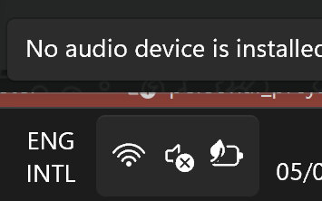
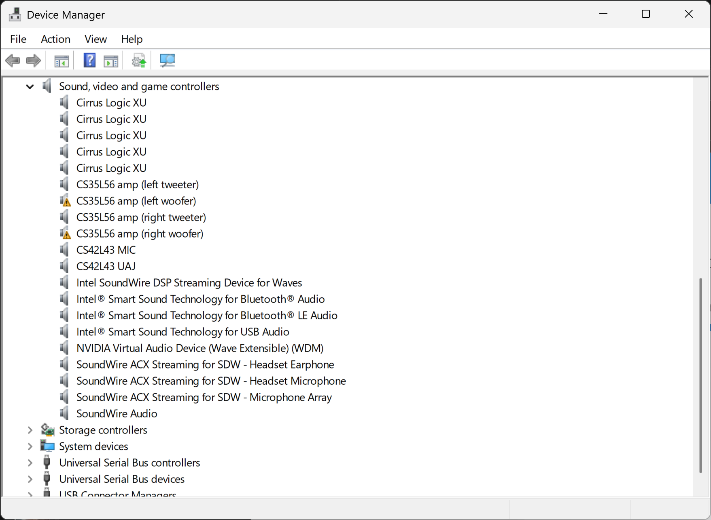

# Audio Fixer

Automatically detects and fixes a common audio driver issue on Dell XPS laptops equipped with Cirrus Logic CS35L56 amplifiers.

## The Problem

After resuming from standby/sleep, the CS35L56 amp devices sometimes fail to reinitialize properly. The Cirrus Logic driver attempts to download firmware to the amps and fails, resulting in **Code 43** errors ("Windows has stopped this device because it has reported problems").

This affects up to 4 devices:
- CS35L56 amp (left tweeter)
- CS35L56 amp (right tweeter)
- CS35L56 amp (left woofer)
- CS35L56 amp (right woofer)

When this happens, Windows reports "No audio device is installed" and the speaker icon in the system tray shows a red cross:



Device Manager shows the affected CS35L56 amp devices with warning indicators:



## The Fix

The only way to restore audio without rebooting is to **disable and re-enable** the parent Intel Smart Sound Technology OED device in Device Manager. This causes the entire SoundWire audio bus to reinitialize, which clears the Code 43 errors on the child CS35L56 amp devices.

Audio Fixer automates this process.

## How It Works

Audio Fixer uses a **Windows Scheduled Task** triggered by the Cirrus Logic driver's own error event:

- **Event source:** `CirrusLogic-Drv-XuCsMe`
- **Event ID:** 101 (firmware download failure)
- **Filter:** Device instance containing `3556` (CS35L56 amps)

When the event fires:
1. The scheduled task launches AudioFixer.exe after a 10-second delay (to allow self-recovery)
2. AudioFixer checks if CS35L56 devices still have Code 43
3. If so, shows a **toast notification** asking the user to confirm the fix
4. On confirmation, disables and re-enables the Intel SST OED device
5. Verifies all devices are healthy and shows the result

No polling, no background process, no memory footprint when idle.

## Installation

```
AudioFixer.exe --install
```

On first run without the flag, AudioFixer will offer to register the scheduled task automatically.

To remove:
```
AudioFixer.exe --uninstall
```

## Usage

The tool runs automatically via the scheduled task. It can also be run manually:

```
AudioFixer.exe             # Interactive: toast notification with Fix/Dismiss
AudioFixer.exe --silent    # Automatic: fix without user interaction
AudioFixer.exe --install   # Register the scheduled task
AudioFixer.exe --uninstall # Remove the scheduled task
```

## Logging

Logs are written to `%LOCALAPPDATA%\AudioFixer\audiofixer.log` with timestamps on every line. Entries older than 14 days are pruned automatically on each run.

## Technical Details

- All device operations use **SetupAPI** and **CfgMgr32** native APIs via P/Invoke (no command-line tools like devcon or pnputil)
- Devices are matched by friendly name ("CS35L56" for amps, "Smart Sound Technology OED" for the parent), making it portable across hardware revisions
- Requires administrator privileges (UAC manifest) for device disable/enable

## Requirements

- Windows 10/11
- .NET 9.0 Runtime
- Dell XPS laptop with CS35L56 audio amplifiers (developed/tested on Dell XPS 16 9640)

## Building

```
dotnet build src/AudioFixer/AudioFixer.csproj
```

## License

MIT
